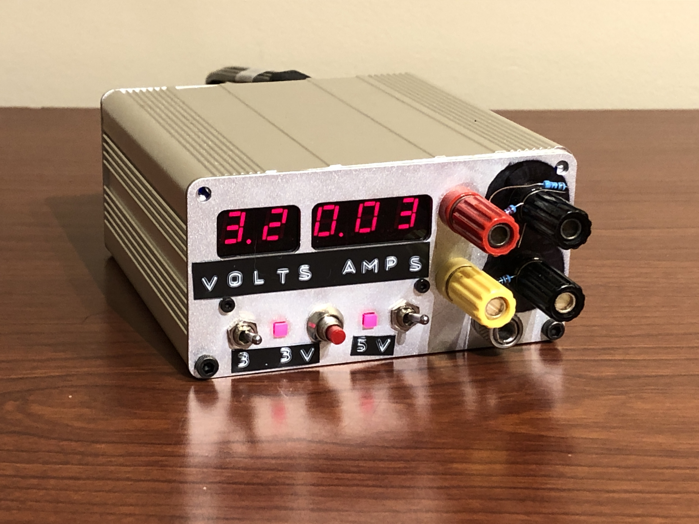

# **Dual Fixed-Voltage Power Supply with V,I Readout**

## Background
The motivation behind this project was that in the past I have come across a need for fixed-voltage 3.3V and 5V supplies. Specifically, I needed a supply that didn’t require me to set up my variable lab power supply at home while also being small, portable, and rugged so that I could take it on the go.
Why did it end up taking on this *”polished”* look? I was looking to gain more SMD soldering experience and further my experience in PCB layout and schematic documentation. So, I approached this project in a more methodical, engineering manner than what I initialled aimed for and typically do when tinkering.
## Design and Construction
The main and display PCBs were drafted and laid out in KiCad, while the back and front enclosure panels were designed in Fusion 360. The code was, and is, written using the Arduino IDE and framework thanks only to the existence of the megaTinyCore library for 2-series attiny chips.
## Result
As seen in the picture above, the resulting power supply is, In my view, *aesthetic*. Although it took two PCB runs of the main board (wrong footprints), 6 interrupted months (~1 month of daily work), and too many hours at the oscilloscope debugging my own oversights, I enjoyed every minute. The approach I took paid off since I've gained a lot of knowledge and experience and the result is something I'm proud to share.
